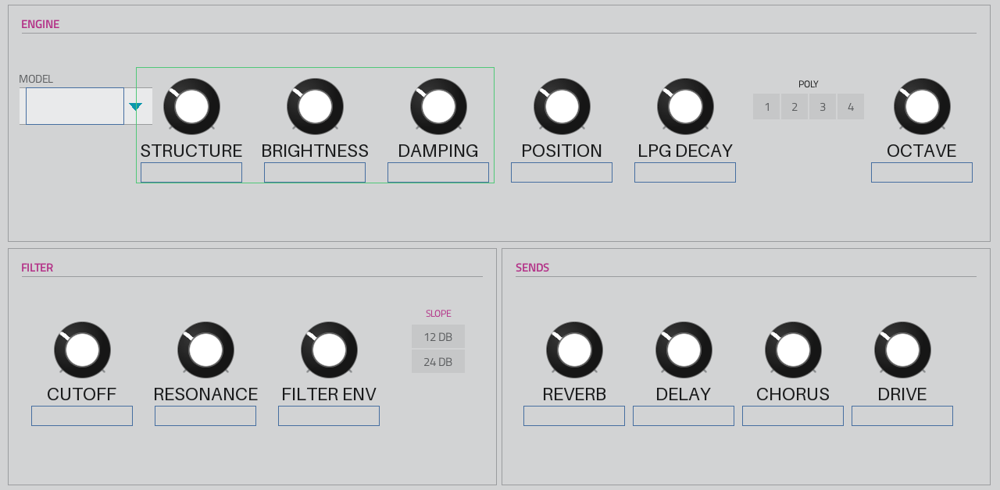

# Mutable Vibe MPC

**A native Akai MPC OS instrument built on Mutable Instruments Rings + Plaits.**
Version **0.9** (public preview).

Mutable Vibe MPC brings the *Rings* resonator and the *Plaits* macro-oscillator into a
single VST2 instrument that runs **inside MPC OS** — no bridge, no background app. It plays
from pads, keys and the sequencer, turns with the Q-Links, and saves with the project, with
its own native MPC touchscreen pages.

> Built with the [mpc-vst-plugins](https://github.com/sd88me/mpc-vst-plugins) porting kit.



## What's in it

- **20 engines** — 6 Rings modes (modal / sympathetic-string / string+reverb / FM / ...) and
  14 Plaits engines (virtual-analog, waveshaping, FM, granular, additive, wavetable, chords,
  speech, noise, particle and the percussion models). Engine names are prefixed `R:` (Rings)
  and `P:` (Plaits); the four main macro knobs relabel per engine to match the originals.
- **State-variable filter** — cutoff, resonance, dedicated filter envelope, 12/24 dB slope.
- **Effects** — reverb, tape delay (free or tempo-synced), chorus, drive.
- **Full modulation** — amp env, filter env, 2 assignable envelopes, **4 LFOs** (free or
  tempo-synced, uni/bipolar, per-destination), 2 velocity-mod slots, mod-wheel and aftertouch,
  all through a mod matrix.
- **Polyphony**, octave shift, tempo sync, per-voice velocity.
- **5 touchscreen pages** in the Mutable Instruments style — OVERVIEW / ENVELOPES / LFOS /
  EFFECTS / MOD — with a matching Q-Link map.

95 skinned parameters across the five pages.

## Status

**Tested only on the MPC One (1st generation / Gen1).** That is the single device it has run
on so far. Other Gen1 MPC OS devices (Live, X, Key, Force) run the same `MPC` program and are
*expected* to behave the same, but this is **unverified** — reports welcome. Gen2 devices
(e.g. Live III) are reported to be more locked down and are not supported.

This is a **0.9 preview**: it works and sounds good, but a couple of edges are still being
smoothed (fast Rings chord voicing; see the tracker).

## Build & install

This port builds with the [mpc-vst-plugins](https://github.com/sd88me/mpc-vst-plugins) kit
(`vst.json` points its build root there). From a checkout that contains both the kit and this
port under `ports/mutable-vibe-mpc/`:

```sh
# offline x86 host test (ASan) — always run first
tools/test_port.sh ports/mutable-vibe-mpc/vst.json

# build the ARM .so + skin for the device
tools/build_port.sh ports/mutable-vibe-mpc/vst.json
```

Then follow [docs/RELEASING.md](https://github.com/sd88me/mpc-vst-plugins/blob/main/docs/RELEASING.md)
to package the release zip + installer, and the plugin/skin install steps in the kit's
`SKILL.md`. The compiled `.so` is device-specific and is **not** checked in.

## Credits & licence

- **Rings** and **Plaits** DSP © 2012–2016 Émilie Gillet / Mutable Instruments — MIT.
  See [`src/VENDORED.md`](src/VENDORED.md) for exactly what is vendored and any local patches.
- Port, MPC integration and skin: **sd88me**.

Released under the MIT License — see [`LICENSE`](LICENSE). Unofficial, non-commercial; not
affiliated with Mutable Instruments.
